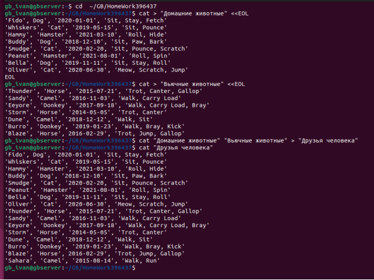
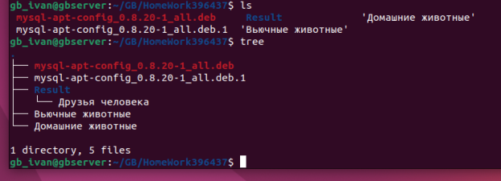
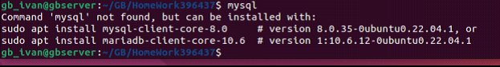
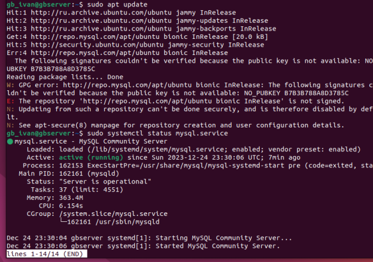

# ControlWork_JavaSql  https://gbcdn.mrgcdn.ru/uploads/asset/4868005/attachment/1f0bfdadc1c954fc748a4890b644e605.pdf

# Итоговая контрольная работа

## Информация о проекте
Необходимо организовать систему учета для питомника в котором живут
домашние и вьючные животные.
## Как сдавать проект
Для сдачи проекта необходимо создать отдельный общедоступный
репозиторий(Github, gitlub, или Bitbucket). Разработку вести в этом
репозитории, использовать пул реквесты на изменения. Программа должна
запускаться и работать, ошибок при выполнении программы быть не должно.
Программа, может использоваться в различных системах, поэтому необходимо
разработать класс в виде конструктора
## Задание
1. Используя команду cat в терминале операционной системы Linux, создать
два файла Домашние животные (заполнив файл собаками, кошками,
хомяками) и Вьючные животными заполнив файл Лошадьми, верблюдами и
ослы), а затем объединить их. Просмотреть содержимое созданного файла.
Переименовать файл, дав ему новое имя (Друзья человека).

СОЗДАЕМ РАБОЧУЮ ДИРРЕКТОРИЮ
```
# work dir : GB/HomeWork396437 
cd~
Cd  GB
mkdir HomeWork396437
cd  ~/GB/HomeWork396437
```
Домашние животные
```
cat > "Домашние животные" <<EOL
'Fido', Dog', '2020-01-01', 'Sit, Stay, Fetch'
'Whiskers', 'Cat', '2019-05-15', 'Sit, Pounce'
'Hammy', 'Hamster', '2021-03-10', 'Roll, Hide'
'Buddy', 'Dog', '2018-12-10', 'Sit, Paw, Bark'
'Smudge', 'Cat', '2020-02-20, 'Sit, Pounce, Scratch'
'Peanut', 'Hamster', '2021-08-01', 'Roll, Spin'
'Bella', 'Dog', '2019-11-11', 'Sit, Stay, Roll'
'Oliver', 'Cat', '2020-06-30', 'Meow, Scratch, Jump'
EOL
```
Вьючные животными
```
cat > "Вьючные животные" <<EOL
'Thunder', 'Horse', '2015-07-21', 'Trot, Canter, Gallop'
'Sandy', 'Camel', '2016-11-03', 'Walk, Carry Load'
'Eeyore', 'Donkey', '2017-09-18', 'Walk, Carry Load, Bray'
'Storm', 'Horse', '2014-05-05', 'Trot, Canter'
'Dune', 'Camel', '2018-12-12', 'Walk, Sit'
'Burro', 'Donkey', '2019-01-23', 'Walk, Bray, Kick'
'Blaze', 'Horse', 2016-02-29', 'Trot, Jump, Gallop'
'Sahara', 'Camel', '2015-08-14', 'Walk, Run'
EOL
```
а затем объединить их, переименовать и распечатать
```
cat "Домашние животные" "Вьючные животные" > "Друзья человека"
cat "Друзья человека"
```



2. Создать директорию, переместить файл туда.

```
mkdir Result
mv "Друзья человека" "Result/"
ls ./Result
tree
```


3. Подключить дополнительный репозиторий MySQL. Установить любой пакет
из этого репозитория.



```
wget https://dev.mysql.com/get/mysql-apt-config_0.8.20-1_all.deb
sudo dpkg -i mysql-apt-config_0.8.20-1_all.deb
```


```
sudo systemctl status mysql.service
```


```
Литература 
PS 
1. https://stackoverflow.com/questions/48012246/unable-to-install-mysql-on-ubuntu-16-04 
2. https://linux.how2shout.com/add-repository-to-install-mysql-5-7-on-ubuntu-20-04-lts-linux/
3. https://www.dev-notes.ru/articles/devops/installing-mysql-server-on-ubuntu-22-04-lts-linux/ 
4. https://ru.stackoverflow.com/questions/992815/Как-установить-mysql-8-0-8-0-15-на-ubuntu-18-04-так-же-для-digitalocean 
5. https://askubuntu.com/questions/640899/how-do-i-uninstall-mysql-completely/640900#640900 
6. https://ruslanmv.com/blog/How-to-create-your-MySQL-Server-in-Virtual-Box 
```


```

```

```
```

```
```


4. Установить и удалить deb-пакет с помощью dpkg.
5. Выложить историю команд в терминале ubuntu
6. Нарисовать диаграмму, в которой есть класс родительский класс, домашние
животные и вьючные животные, в составы которых в случае домашних
животных войдут классы: собаки, кошки, хомяки, а в класс вьючные животные
войдут: Лошади, верблюды и ослы).
7. В подключенном MySQL репозитории создать базу данных “Друзья
человека”
8. Создать таблицы с иерархией из диаграммы в БД
9. Заполнить низкоуровневые таблицы именами(животных), командами
которые они выполняют и датами рождения
10. Удалив из таблицы верблюдов, т.к. верблюдов решили перевезти в другой
питомник на зимовку. Объединить таблицы лошади, и ослы в одну таблицу.
11.Создать новую таблицу “молодые животные” в которую попадут все
животные старше 1 года, но младше 3 лет и в отдельном столбце с точностью
до месяца подсчитать возраст животных в новой таблице
12. Объединить все таблицы в одну, при этом сохраняя поля, указывающие на
прошлую принадлежность к старым таблицам.
13.Создать класс с Инкапсуляцией методов и наследованием по диаграмме.
14. Написать программу, имитирующую работу реестра домашних животных.
В программе должен быть реализован следующий функционал:
14.1 Завести новое животное
14.2 определять животное в правильный класс
14.3 увидеть список команд, которое выполняет животное
14.4 обучить животное новым командам
14.5 Реализовать навигацию по меню
15.Создайте класс Счетчик, у которого есть метод add(), увеличивающий̆
значение внутренней̆int переменной̆на 1 при нажатие “Завести новое
животное” Сделайте так, чтобы с объектом такого типа можно было работать в
блоке try-with-resources. Нужно бросить исключение, если работа с объектом
типа счетчик была не в ресурсном try и/или ресурс остался открыт. Значение
считать в ресурсе try, если при заведения животного заполнены все поля.
