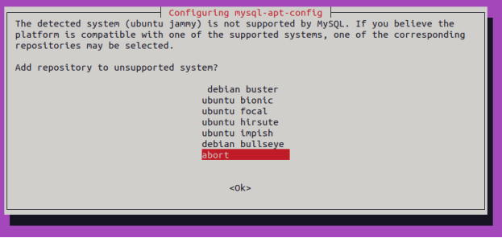

# ControlWork_JavaSql  https://gbcdn.mrgcdn.ru/uploads/asset/4868005/attachment/1f0bfdadc1c954fc748a4890b644e605.pdf
ОРИГИНАЛЬНОЕ ЗАДАНИЕ  "Итоговая контрольная работа.docx"
# Итоговая контрольная работа

## Информация о проекте
Необходимо организовать систему учета для питомника в котором живут
домашние и вьючные животные.
## Как сдавать проект
Для сдачи проекта необходимо создать отдельный общедоступный
репозиторий(Github, gitlub, или Bitbucket). Разработку вести в этом
репозитории, использовать пул реквесты на изменения. Программа должна
запускаться и работать, ошибок при выполнении программы быть не должно.
Программа, может использоваться в различных системах, поэтому необходимо
разработать класс в виде конструктора
## Задание
1. Используя команду cat в терминале операционной системы Linux, создать
два файла Домашние животные (заполнив файл собаками, кошками,
хомяками) и Вьючные животными заполнив файл Лошадьми, верблюдами и
ослы), а затем объединить их. Просмотреть содержимое созданного файла.
Переименовать файл, дав ему новое имя (Друзья человека).

СОЗДАЕМ РАБОЧУЮ ДИРРЕКТОРИЮ
```
# work dir : GB/HomeWork396437 
cd~
Cd  GB
mkdir HomeWork396437
cd  ~/GB/HomeWork396437
```
Домашние животные
```
cat > "Домашние животные" <<EOL
'Fido', Dog', '2020-01-01', 'Sit, Stay, Fetch'
'Whiskers', 'Cat', '2019-05-15', 'Sit, Pounce'
'Hammy', 'Hamster', '2021-03-10', 'Roll, Hide'
'Buddy', 'Dog', '2018-12-10', 'Sit, Paw, Bark'
'Smudge', 'Cat', '2020-02-20, 'Sit, Pounce, Scratch'
'Peanut', 'Hamster', '2021-08-01', 'Roll, Spin'
'Bella', 'Dog', '2019-11-11', 'Sit, Stay, Roll'
'Oliver', 'Cat', '2020-06-30', 'Meow, Scratch, Jump'
EOL
```
Вьючные животными
```
cat > "Вьючные животные" <<EOL
'Thunder', 'Horse', '2015-07-21', 'Trot, Canter, Gallop'
'Sandy', 'Camel', '2016-11-03', 'Walk, Carry Load'
'Eeyore', 'Donkey', '2017-09-18', 'Walk, Carry Load, Bray'
'Storm', 'Horse', '2014-05-05', 'Trot, Canter'
'Dune', 'Camel', '2018-12-12', 'Walk, Sit'
'Burro', 'Donkey', '2019-01-23', 'Walk, Bray, Kick'
'Blaze', 'Horse', 2016-02-29', 'Trot, Jump, Gallop'
'Sahara', 'Camel', '2015-08-14', 'Walk, Run'
EOL
```
а затем объединить их, переименовать и распечатать
```
cat "Домашние животные" "Вьючные животные" > "Друзья человека"
cat "Друзья человека"
```


2. Создать директорию, переместить файл туда.

```
mkdir Result
mv "Друзья человека" "Result/"
ls ./Result
tree
```


3. Подключить дополнительный репозиторий MySQL. Установить любой пакет
из этого репозитория.


```
wget https://dev.mysql.com/get/mysql-apt-config_0.8.20-1_all.deb
sudo dpkg -i mysql-apt-config_0.8.20-1_all.deb
```



```
sudo systemctl status mysql.service
```


```
Литература 
PS 
1. https://stackoverflow.com/questions/48012246/unable-to-install-mysql-on-ubuntu-16-04 
2. https://linux.how2shout.com/add-repository-to-install-mysql-5-7-on-ubuntu-20-04-lts-linux/
3. https://www.dev-notes.ru/articles/devops/installing-mysql-server-on-ubuntu-22-04-lts-linux/ 
4. https://ru.stackoverflow.com/questions/992815/Как-установить-mysql-8-0-8-0-15-на-ubuntu-18-04-так-же-для-digitalocean 
5. https://askubuntu.com/questions/640899/how-do-i-uninstall-mysql-completely/640900#640900 
6. https://ruslanmv.com/blog/How-to-create-your-MySQL-Server-in-Virtual-Box 
```

4. Установить и удалить deb-пакет с помощью dpkg.

```
```

```
```

5. Выложить историю команд в терминале ubuntu


6. Нарисовать диаграмму, в которой есть класс родительский класс, домашние
животные и вьючные животные, в составы которых в случае домашних
животных войдут классы: собаки, кошки, хомяки, а в класс вьючные животные
войдут: Лошади, верблюды и ослы).

```
```

```
```
7. В подключенном MySQL репозитории создать базу данных “Друзья
человека”

```
DROP DATABASE IF EXISTS Друзья_человека;

-- Создаем базу данных 'human_friends', если ее еще нет
CREATE DATABASE IF NOT EXISTS Друзья_человека;

-- Используем созданную базу данных
USE Друзья_человека;
```
8. Создать таблицы с иерархией из диаграммы в БД
   Создаем служебные таблицы и процедуры

```
--  MySQL Sequence   https://stackoverflow.com/questions/26578313/how-do-i-create-a-sequence-in-mysql
--   odd for tables: животные домашние вьючные
--   even  for tables: собаки кошки хомячки лошади верблюды ослы  лошади_ослы
CREATE TABLE SEQUENCES  
(  
  NM_SEQUENCE VARCHAR(32) NOT NULL UNIQUE,  
  VR_SEQUENCE BIGINT      NOT NULL  
);  

DROP PROCEDURE IF EXISTS CreateSequence;  

DELIMITER :)  
CREATE PROCEDURE CreateSequence( sSeqName VARCHAR(32), iSeqValue BIGINT )  
BEGIN  
  IF NOT EXISTS ( SELECT * FROM SEQUENCES WHERE (NM_SEQUENCE = sSeqName) ) THEN  
    INSERT INTO SEQUENCES (NM_SEQUENCE, VR_SEQUENCE)  
    VALUES (sSeqName   , iSeqValue  );  
  END IF;  
END :)  
DELIMITER ;  

-- CALL CreateSequence( 'MySequence', 0 );  
CALL CreateSequence( 'SequenceOdd', 1 );  -- init 
CALL CreateSequence( 'SequenceEven', 2 );  -- init 

DROP FUNCTION IF EXISTS GetSequenceVal;  

DELIMITER :)  
CREATE FUNCTION GetSequenceVal( sSeqName VARCHAR(32), iIncrement INTEGER )  
RETURNS BIGINT  -- iIncrement can be negative  
READS SQL DATA
DETERMINISTIC
BEGIN  
  DECLARE iSeqValue BIGINT;  

  SELECT VR_SEQUENCE FROM SEQUENCES  
  WHERE  ( NM_SEQUENCE = sSeqName )  
  INTO   @iSeqValue;  

  IF ( iIncrement <> 0 ) THEN  
    SET @iSeqValue = @iSeqValue + iIncrement;  

    UPDATE SEQUENCES SET VR_SEQUENCE = @iSeqValue  
    WHERE  ( NM_SEQUENCE = sSeqName );  
  END IF;

  RETURN @iSeqValue;
END :)  
DELIMITER ;  
-- SELECT GetSequenceVal('MySequence', 1);  -- Adds 1 to MySequence value and returns it.

DROP FUNCTION IF EXISTS GSVal; -- , GSValOdd, GSValEven; 
DELIMITER :)  
CREATE FUNCTION GSVal( sSeqName VARCHAR(32), iIncrement INTEGER )  
RETURNS BIGINT  -- iIncrement can be negative  
READS SQL DATA
DETERMINISTIC
BEGIN  
  DECLARE iSeqValue BIGINT;  
  SELECT GetSequenceVal('MySequence', iIncrement) INTO   @iSeqValue;
  RETURN @iSeqValue;
END :) 
DELIMITER ;

DELIMITER :)  
--  GSValOdd
DROP FUNCTION IF EXISTS GSValOdd :) 
CREATE FUNCTION GSValOdd()  
RETURNS BIGINT  -- iIncrement can be negative  
READS SQL DATA
DETERMINISTIC
BEGIN  
  DECLARE iSeqValue BIGINT;  
  SELECT GetSequenceVal('SequenceOdd', 2) INTO   @iSeqValue;
  RETURN @iSeqValue;
END :) 
DELIMITER ; 

DELIMITER :) 
--  GSValEven
DROP FUNCTION IF EXISTS GSValEven :) 
CREATE FUNCTION GSValEven()  
RETURNS BIGINT  -- iIncrement can be negative  
READS SQL DATA
DETERMINISTIC
BEGIN  
  DECLARE iSeqValue BIGINT;  
  SELECT GetSequenceVal('SequenceEven', 2) INTO   @iSeqValue;
  RETURN @iSeqValue;
END :) 
DELIMITER ;  

-- SEQUENCES like it works on firebird:  END

--   odd for tables: животные домашние вьючные
--   even  for tables: собаки кошки хомячки лошади верблюды ослы  лошади_ослы

-- SELECT GSValOdd();
-- SELECT GSValEven();
```
таблицы с иерархией из диаграммы в БД
```
CREATE TABLE животные (  -- odd for tables: животные домашние вьючные
  id INT UNSIGNED NOT NULL  PRIMARY KEY UNIQUE,  -- AUTO_INCREMENT  !!! use SELECT GSValOdd()
  вид VARCHAR(25)
  , CONSTRAINT UQ_вид UNIQUE(вид)
);


CREATE TABLE домашние ( -- собаки кошки хомячки
  id INT UNSIGNED NOT NULL  PRIMARY KEY UNIQUE,   -- AUTO_INCREMENT  !!! use SELECT GSValOdd()
  вид VARCHAR(25), 
  видId INT UNSIGNED NOT NULL,
  FOREIGN KEY (видId) REFERENCES животные (`id`) ON DELETE CASCADE
  , CONSTRAINT UQ_вид UNIQUE(вид) 
);

CREATE TABLE вьючные (  -- лошади ослы верблюды
  id INT UNSIGNED NOT NULL  PRIMARY KEY UNIQUE,   -- AUTO_INCREMENT  !!! use SELECT GSValOdd()
  вид VARCHAR(25),
  видId INT UNSIGNED NOT NULL,
  FOREIGN KEY (видId) REFERENCES животные (`id`) ON DELETE CASCADE
  , CONSTRAINT UQ_вид UNIQUE(вид)
);


-- Создаем таблицу собаки с внешним ключом на таблицу домашние
DROP TABLE IF EXISTS собаки;
CREATE TABLE собаки (
  --  id INT UNSIGNED NOT NULL AUTO_INCREMENT PRIMARY KEY UNIQUE,
    id INT UNSIGNED NOT NULL PRIMARY KEY UNIQUE,
  имя VARCHAR(25) NOT NULL,
  команды VARCHAR(70) NOT NULL,
  дата_рождения DATE NOT NULL,
  видId INT UNSIGNED NOT NULL,
  FOREIGN KEY (видId) REFERENCES домашние (`id`) ON DELETE CASCADE  -- животные
    , CONSTRAINT UQ_имя_дата_рождения UNIQUE(имя, дата_рождения)
);


-- Создаем таблицу кошки с внешним ключом на таблицу домашние
DROP TABLE IF EXISTS кошки;
CREATE TABLE кошки (
   id INT UNSIGNED NOT NULL AUTO_INCREMENT PRIMARY KEY UNIQUE,
  имя VARCHAR(25) NOT NULL,
  команды VARCHAR(70) NOT NULL,
  дата_рождения DATE NOT NULL,
  видId INT UNSIGNED NOT NULL,
  FOREIGN KEY (видId) REFERENCES домашние (`id`) ON DELETE CASCADE
    , CONSTRAINT UQ_имя_дата_рождения UNIQUE(имя, дата_рождения)
);

-- Создаем таблицу хомячки с внешним ключом на таблицу домашние
DROP TABLE IF EXISTS хомячки;
CREATE TABLE хомячки (
   id INT UNSIGNED NOT NULL AUTO_INCREMENT PRIMARY KEY UNIQUE,
  имя VARCHAR(25) NOT NULL,
  команды VARCHAR(70) NOT NULL,
  дата_рождения DATE NOT NULL,
  видId INT UNSIGNED NOT NULL,
  FOREIGN KEY (видId) REFERENCES домашние (`id`) ON DELETE CASCADE
    , CONSTRAINT UQ_имя_дата_рождения UNIQUE(имя, дата_рождения)
);


-- Создаем таблицу лошади с внешним ключом на таблицу вьючные
DROP TABLE IF EXISTS лошади;
CREATE TABLE лошади (
   id INT UNSIGNED NOT NULL AUTO_INCREMENT PRIMARY KEY UNIQUE,
  имя VARCHAR(25) NOT NULL,
  команды VARCHAR(70) NOT NULL,
  дата_рождения DATE NOT NULL,
  видId INT UNSIGNED NOT NULL,
  FOREIGN KEY (видId) REFERENCES вьючные (`id`) ON DELETE CASCADE
    , CONSTRAINT UQ_имя_дата_рождения UNIQUE(имя, дата_рождения)
);

-- Создаем таблицу верблюды с внешним ключом на таблицу вьючные
DROP TABLE IF EXISTS верблюды;
CREATE TABLE верблюды (
   id INT UNSIGNED NOT NULL AUTO_INCREMENT PRIMARY KEY UNIQUE,
  имя VARCHAR(25) NOT NULL,
  команды VARCHAR(70) NOT NULL,
  дата_рождения DATE NOT NULL,
  видId INT UNSIGNED NOT NULL,
  FOREIGN KEY (видId) REFERENCES вьючные (`id`) ON DELETE CASCADE
    , CONSTRAINT UQ_имя_дата_рождения UNIQUE(имя, дата_рождения)
);

-- Создаем таблицу ослы с внешним ключом на таблицу вьючные
DROP TABLE IF EXISTS ослы;
CREATE TABLE ослы (
   id INT UNSIGNED NOT NULL AUTO_INCREMENT PRIMARY KEY UNIQUE,
  имя VARCHAR(25) NOT NULL,
  команды VARCHAR(70) NOT NULL,
  дата_рождения DATE NOT NULL,
  видId INT UNSIGNED NOT NULL,
  FOREIGN KEY (видId) REFERENCES вьючные (`id`) ON DELETE CASCADE
    , CONSTRAINT UQ_имя_дата_рождения UNIQUE(имя, дата_рождения)
);
```

9. Заполнить низкоуровневые таблицы именами(животных), командами
которые они выполняют и датами рождения

```
-- Заполняем таблицу животные
INSERT INTO Друзья_человека.животные (`id`, `вид`) VALUES 
	((GSValOdd()), 'домашнее'),
    ((GSValOdd()), 'вьючные');
SELECT * FROM Друзья_человека.животные;

```

```
select id from Друзья_человека.животные
where вид = 'домашнее' into   @iHome;
select   @iHome;

select id from Друзья_человека.животные
where вид = 'вьючные' into   @iPack;
select   @iPack;

--  Заполняем таблицу домашние: собаки кошки хомячки
INSERT INTO Друзья_человека.домашние (`id`, `вид`, `видId`) VALUES  -- собаки кошки хомячки
	((GSValOdd()), 'собаки', (@iHome)),
    ((GSValOdd()), 'кошки', (@iHome)),
    ((GSValOdd()), 'хомячки', (@iHome)); 
    
-- Заполняем таблицу вьючные: лошади верблюды ослы
INSERT INTO Друзья_человека.вьючные (`id`, `вид`, `видId`) VALUES -- лошади верблюды ослы
	((GSValOdd()), 'лошади', (@iPack)),
    ((GSValOdd()), 'верблюды',  (@iPack)), 
    ((GSValOdd()), 'ослы',  (@iPack));    

```


```
select id from Друзья_человека.домашние where вид = 'собаки' into   @iDog; select   @iDog;
select id from Друзья_человека.домашние where вид = 'кошки' into   @iCat; select   @iCat;
select id from Друзья_человека.домашние where вид = 'хомячки' into   @iHamsters; select   @iHamsters;
-- select id from Друзья_человека.домашние where вид = '007' into   @i007; select   @i007;

select id from Друзья_человека.вьючные where вид = 'лошади' into   @iHorses; select   @iHorses;
select id from Друзья_человека.вьючные where вид = 'верблюды' into   @iCamels; select   @iCamels;
select id from Друзья_человека.вьючные where вид = 'ослы' into   @iDonkeys; select   @iDonkeys;

-- Заполняем таблицу собаки
INSERT INTO Друзья_человека.собаки (id, имя, команды, дата_рождения, видId) VALUES
  ((GSValEven()), 'Buddy', 'Sit, Stay, Fetch', '2019-02-10', (@iDog)),
  ((GSValEven()), 'Max', 'Roll over, Shake hands', '2018-06-15', (@iDog)),
  ((GSValEven()), 'Bailey', 'Play dead, Jump', '2020-01-05', (@iDog)),
  ((GSValEven()), 'Charlie', 'Speak, Catch', '2017-09-20', (@iDog)),
  ((GSValEven()), 'Luna', 'Bark, Spin', '2016-12-08', (@iDog));
  SELECT * FROM Друзья_человека.собаки;

-- Заполняем таблицу кошки
INSERT INTO Друзья_человека.кошки (id, имя, команды, дата_рождения, видId) VALUES
  (( GSValEven()), 'Oliver', 'Purr, Pounce', '2018-04-25', (@iCat)),
  (( GSValEven()), 'Leo', 'Groom, Sleep', '2019-07-10', (@iCat)),
  (( GSValEven()), 'Milo', 'Climb, Hunt', '2020-03-17', (@iCat)),
  (( GSValEven()), 'Lily', 'Stretch, Chase', '2017-11-30', (@iCat)),
  (( GSValEven()), 'Simba', 'Meow, Play', '2016-09-12', (@iCat));
  SELECT * FROM Друзья_человека.кошки;
  
-- Заполняем таблицу хомячки
INSERT INTO Друзья_человека.хомячки (id, имя, команды, дата_рождения, видId) VALUES
  (( GSValEven()), 'Coco', 'Run on the wheel', '2021-01-03', (@iHamsters)),
  (( GSValEven()), 'Peanut', 'Hide food, Burrow', '2022-02-14', (@iHamsters)),
  (( GSValEven()), 'Oreo', 'Climb tubes', '2020-11-20', (@iHamsters)),
  (( GSValEven()), 'Biscuit', 'Cheek pouches, Dig', '2019-10-05', (@iHamsters)),
  (( GSValEven()), 'Hazel', 'Gnaw, Explore', '2023-04-01', (@iHamsters));
  SELECT * FROM Друзья_человека.хомячки;
  
-- Заполняем таблицу лошади
INSERT INTO Друзья_человека.лошади (id, имя, команды, дата_рождения, видId) VALUES
  (( GSValEven()), 'Spirit', 'Gallop, Jump', '2015-08-20', (@iHorses)),
  (( GSValEven()), 'Daisy', 'Trot, Lunge', '2016-06-10', (@iHorses)),
  (( GSValEven()), 'Apollo', 'Dressage, Canter', '2017-03-15', (@iHorses)),
  (( GSValEven()), 'Willow', 'Trail riding, Vaulting', '2018-11-25', (@iHorses)),
  (( GSValEven()), 'Rocky', 'Western riding, Reining', '2019-09-05', (@iHorses));
  SELECT * FROM Друзья_человека.лошади;
  
-- Заполняем таблицу верблюды
INSERT INTO Друзья_человека.верблюды (id, имя, команды, дата_рождения, видId) VALUES
  (( GSValEven()), 'Sahara', 'Carry loads, Long trek', '2014-12-01', (@iCamels)),
  (( GSValEven()), 'Amir', 'Desert navigation, Endurance', '2015-10-18', (@iCamels)),
  (( GSValEven()), 'Zara', 'Pack saddle, Camel race', '2016-07-24', (@iCamels)),
  (( GSValEven()), 'Raja', 'Camel ride, Milk production', '2017-04-09', (@iCamels)),
  (( GSValEven()), 'Jamal', 'Hump storage, Adaptation', '2018-02-15', (@iCamels));
  SELECT * FROM Друзья_человека.верблюды;  
  
-- Заполняем таблицу ослы
INSERT INTO Друзья_человека.ослы (id, имя, команды, дата_рождения, видId) VALUES
  (( GSValEven()), 'Jack', 'Carry load, Braying', '2019-08-12', (@iDonkeys)),
  (( GSValEven()), 'Jenny', 'Grazing, Guarding', '2020-05-05', (@iDonkeys)),
  (( GSValEven()), 'Molly', 'Plowing, Companion', '2021-02-20', (@iDonkeys)),
  (( GSValEven()), 'Oscar', 'Stubbornness, Towing', '2022-09-10', (@iDonkeys)),
  (( GSValEven()), 'Rosie', 'Trick training, Therapy', '2023-06-05', (@iDonkeys));
  SELECT * FROM Друзья_человека.ослы;
```


10. Удалив из таблицы верблюдов(!!! Верблюды в отдельной таблице ???), т.к. верблюдов решили перевезти в другой
питомник на зимовку. Объединить таблицы лошади, и ослы в одну таблицу.

```
-- Удалить таблицу верблюды
  DROP TABLE  IF EXISTS  Друзья_человека.верблюды;  -- DROP TABLE IF EXISTS ;
-- SELECT * FROM  Друзья_человека.верблюды;  -- Error Code: 1146. Table 'Друзья_человека.верблюды' doesn't exist
```

```
-- Объединить таблицы лошади, и ослы в одну таблицу
-- Создаем новую таблицу лошади_ослы  для объединения лошади и ослы
DROP TABLE IF EXISTS лошади_ослы;


CREATE TABLE лошади_ослы (
   id INT UNSIGNED NOT NULL AUTO_INCREMENT PRIMARY KEY UNIQUE,
  имя VARCHAR(25) NOT NULL,
  команды VARCHAR(70) NOT NULL,
  дата_рождения DATE NOT NULL,
  видId INT UNSIGNED NOT NULL,
  вид VARCHAR(25) NOT NULL,
  FOREIGN KEY (видId) REFERENCES вьючные ( id ) ON DELETE CASCADE
    , CONSTRAINT UQ_имя_дата_рождения UNIQUE(имя, дата_рождения)
);

-- Вставляем данные из лошади в таблицу лошади_ослы 
INSERT INTO лошади_ослы (id, имя, команды, дата_рождения, видId, вид)
SELECT id, имя, команды, дата_рождения, видId, 'лошади' AS вид  FROM лошади  UNION 
-- Вставляем данные из ослы в таблицу лошади_ослы 
-- INSERT INTO лошади_ослы (id, имя, команды, дата_рождения, видId, вид)
SELECT id, имя, команды, дата_рождения, видId, 'ослы' AS вид  FROM ослы;

  SELECT * FROM Друзья_человека.лошади_ослы;

SELECT * FROM Друзья_человека.лошади_ослы;
```

11. Создать новую таблицу “молодые животные” (подростки) в которую попадут все
животные старше 1 года, но младше 3 лет и в отдельном столбце с точностью
до месяца подсчитать возраст животных в новой таблице

```
-- Создаем новую таблицу подростки  
DROP TABLE IF EXISTS подростки;
CREATE TABLE подростки (
  id INT UNSIGNED NOT NULL  PRIMARY KEY,
  имя VARCHAR(25) NOT NULL,
  вид VARCHAR(25) NOT NULL,
  возраст_месяц INT NOT NULL,  
  видId INT UNSIGNED NOT NULL
        , CONSTRAINT UQ_имя_вид_возраст UNIQUE(имя, вид, возраст_месяц)
);
```

```
-- Вставляем данные из таблиц собаки, кошки, ослы, хомячки, и лошади в таблицу подростки    
    --  'в возрасте от 1 до 3 лет'
    --  WHERE дата_рождения <= DATE_SUB(CURDATE(), INTERVAL 1 YEAR) AND дата_рождения >= DATE_SUB(CURDATE(), INTERVAL 3 YEAR);
    -- 
    -- WHERE дата_рождения BETWEEN @dateStart AND @dateEnd;
    -- 
    SET @dateStart = DATE_SUB(CURDATE(), INTERVAL 3 YEAR);
    SET @dateEnd =   DATE_SUB(CURDATE(), INTERVAL 1 YEAR);
  
    
  -- for tables: собаки кошки хомячки (лошади верблюды ослы)==лошади_ослы  
INSERT INTO подростки (id, имя, вид, возраст_месяц, видId)
SELECT id, имя, 'собаки' AS вид, TIMESTAMPDIFF(MONTH, дата_рождения, CURDATE()) AS возраст_месяц, видId
FROM собаки
WHERE дата_рождения BETWEEN @dateStart AND @dateEnd;

INSERT INTO подростки (id, имя, вид, возраст_месяц, видId)
SELECT id, имя, 'кошки' AS вид, TIMESTAMPDIFF(MONTH, дата_рождения, CURDATE()) AS возраст_месяц, видId
FROM кошки
WHERE дата_рождения BETWEEN @dateStart AND @dateEnd;

INSERT INTO подростки (id, имя, вид, возраст_месяц, видId)
SELECT id, имя, 'хомячки' AS вид, TIMESTAMPDIFF(MONTH, дата_рождения, CURDATE()) AS возраст_месяц, видId
FROM хомячки
WHERE дата_рождения <= DATE_SUB(CURDATE(), INTERVAL 1 YEAR) AND дата_рождения >= DATE_SUB(CURDATE(), INTERVAL 3 YEAR);

INSERT INTO подростки (id, имя, вид, возраст_месяц, видId)
SELECT id, имя, 'лошади' AS вид, TIMESTAMPDIFF(MONTH, дата_рождения, CURDATE()) AS возраст_месяц, видId
FROM лошади
WHERE дата_рождения BETWEEN @dateStart AND @dateEnd;

INSERT INTO подростки (id, имя, вид, возраст_месяц, видId)
SELECT id, имя, 'ослы' AS вид, TIMESTAMPDIFF(MONTH, дата_рождения, CURDATE()) AS возраст_месяц, видId
FROM ослы
WHERE дата_рождения BETWEEN @dateStart AND @dateEnd;

SELECT * FROM Друзья_человека.подростки;

```

12. Объединить все таблицы в одну, при этом сохраняя поля, указывающие на
прошлую принадлежность к старым таблицам.

```
-- Создаем новую таблицу 'все_животные'

DROP TABLE IF EXISTS все_животные;
CREATE TABLE все_животные (
   id INT UNSIGNED NOT NULL  UNIQUE,
  имя VARCHAR(25) NOT NULL,
  команды VARCHAR(70) NOT NULL,
  дата_рождения DATE NOT NULL,  
  видId INT UNSIGNED NOT NULL,
  таблица VARCHAR(25) NOT NULL,
  PRIMARY KEY ( id ),
        CONSTRAINT UQ_имя_дата_рождения_таблица UNIQUE(имя, дата_рождения, таблица)
);
```

```
-- Вставляем данные из таблиц собаки, кошки, ослы, хомячки, и лошади в таблицу все_животные
INSERT INTO все_животные (id, имя, команды, дата_рождения, видId, таблица)
SELECT id, имя, команды, дата_рождения, видId, 'собаки' AS таблица
FROM собаки;

INSERT INTO все_животные (id, имя, команды, дата_рождения, видId, таблица)
SELECT id, имя, команды, дата_рождения, видId, 'кошки' AS таблица
FROM кошки;

INSERT INTO все_животные (id, имя, команды, дата_рождения, видId, таблица)
SELECT id, имя, команды, дата_рождения, видId, 'ослы' AS таблица
FROM ослы;

INSERT INTO все_животные (id, имя, команды, дата_рождения, видId, таблица)
SELECT id, имя, команды, дата_рождения, видId,  'хомячки'  AS таблица
FROM хомячки;

INSERT INTO все_животные (id, имя, команды, дата_рождения, видId, таблица)
SELECT id, имя, команды, дата_рождения, видId, 'лошади' AS таблица
FROM лошади;

    SELECT * FROM Друзья_человека.все_животные;

-- END SQL 	24.12.2023
```


13. Создать класс с Инкапсуляцией методов и наследованием по диаграмме.
14. Написать программу, имитирующую работу реестра домашних животных.
В программе должен быть реализован следующий функционал:
14.1 Завести новое животное
14.2 определять животное в правильный класс
14.3 увидеть список команд, которое выполняет животное
14.4 обучить животное новым командам
14.5 Реализовать навигацию по меню
15.Создайте класс Счетчик, у которого есть метод add(), увеличивающий̆
значение внутренней̆int переменной̆на 1 при нажатие “Завести новое
животное” Сделайте так, чтобы с объектом такого типа можно было работать в
блоке try-with-resources. Нужно бросить исключение, если работа с объектом
типа счетчик была не в ресурсном try и/или ресурс остался открыт. Значение
считать в ресурсе try, если при заведения животного заполнены все поля.
